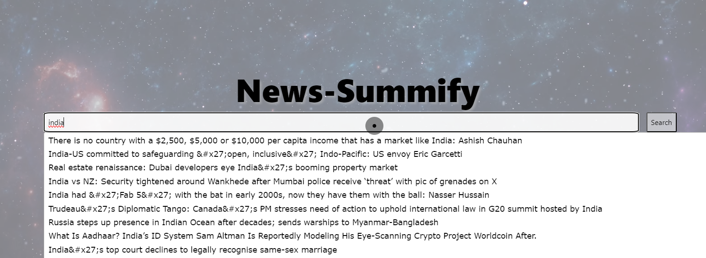

# OpenCraft24-Summify


**# Project Name: Summify**


This innovative project combines two powerful tools: a web app for comprehensive keyword-based article discovery and summarization, and a browser extension for seamless on-page summarization. With intuitive interfaces and intelligent processing, it empowers users to explore information efficiently and gain insights effortlessly.

Check out this video demonstration of the project: [Project Demo](https://www.youtube.com).


**Key Features:**

* **Intuitive Web App:**
    * **Effortless Autocomplete:** Ensures fast and accurate keyword exploration.
      
    * **Relevant Article Discovery:** Leverages powerful search algorithms to surface the most pertinent articles from a vast dataset.
    * **Direct Article Access:** Seamlessly opens articles in browser tabs for in-depth reading.
* **Powerful Summarization Extension:**
    * **One-Click Summarization:** Instantly summarizes webpages on the current tab, saving valuable time.
    * **Customizable Length:** Tailors summaries to fit individual needs and preferences.
    * **Advanced Scraping:** Extracts key textual content for accurate summarization.
    * **Related Article Suggestions:** Offers further exploration based on summarized content.

**Workflow:**

1. **Web App:**
    * **Enter a keyword or phrase.**
    * **Enjoy autocomplete suggestions for faster exploration.**
    * **Discover relevant articles from the comprehensive dataset.**
    * **Click on an article to open it directly in your browser.**
2. **Summarization Extension (for Chrome/Firefox):**
    * **Install the extension in your browser.**
    * **Navigate to an article or webpage.**
    * **Click the extension's icon to initiate summarization.**
    * **Specify the desired summary length (optional).**
    * **Review the concise summary, highlighting key points.**
    * **Explore suggested related articles for deeper understanding.**

**Technical Details:**

* **Web App:**
    * Programming language: [e.g., Python, JavaScript]
    * Framework: [e.g., Flask, Django, React]
    * Dataset source: [e.g., Wikipedia, custom corpus]
    * Search algorithm: [e.g., TF-IDF, BM25]
* **Summarization Extension:**
    * Development environment: [e.g., WebExtensions API]
    * Summarization technique: [e.g., TextRank, LexRank]
    * Related article suggestion: [e.g., content-based filtering, collaborative filtering]

**Code Example (Keyword Processing):**

```python
def process_text(text):
    """Process text function.
    Input:
        text: a string containing the text
    Output:
        processed_text: a list of words containing the processed text

    """
    stemmer = PorterStemmer()
    stopwords_english = stopwords.words('english')

    # remove stock market tickers like $GE
    text = re.sub(r'\$\w*', '', text)
    # remove old style retweet text "RT"
    text = re.sub(r'^RT[\s]+', '', text)
    # remove hyperlinks    
    text = re.sub(r'https?://[^\s\n\r]+', '', text)
    # remove hashtags
    # only removing the hash # sign from the word
    text = re.sub(r'#', '', text)
    # tokenize text
    tokenizer = TweetTokenizer(preserve_case=False, strip_handles=True,
                               reduce_len=True)
    text_tokens = tokenizer.tokenize(text)

    processed_text = []
    for word in text_tokens:
        if (word not in stopwords_english and  # remove stopwords
                word not in string.punctuation):  # remove punctuation
            # processed_text.append(word)
            stem_word = stemmer.stem(word)  # stemming word
            processed_text.append(stem_word)

    return processed_text

```

**Screenshots:**

[Image of Web App Interface]
[Image of Summarization Extension in Use]

**GitHub Repositories:**

* Web App: [[[invalid URL removed]]([invalid URL removed])]
* Summarization Extension: [[[invalid URL removed]]([invalid URL removed])]

**Benefits:**

* **Enhanced Research Efficiency:** Find exactly what you need quickly and easily.
* **Deeper Understanding:** Summarize complex information for effortless knowledge gain.
* **Time-Saving Convenience:** Seamless integration and one-click summarization.
* **Customizable Experience:** Tailored summaries to fit your needs.

